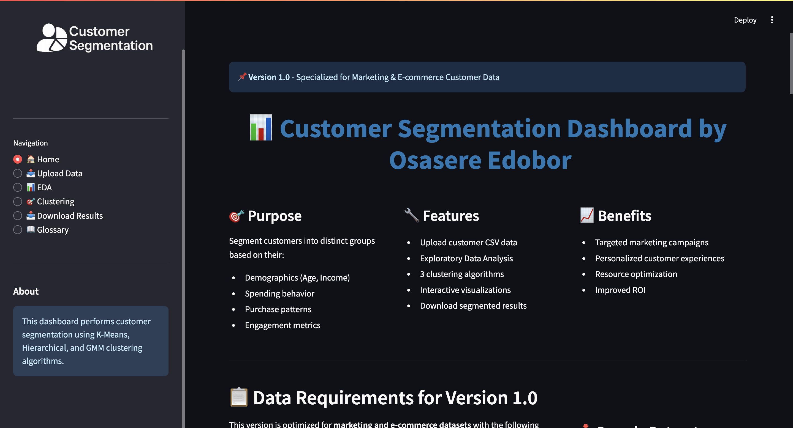
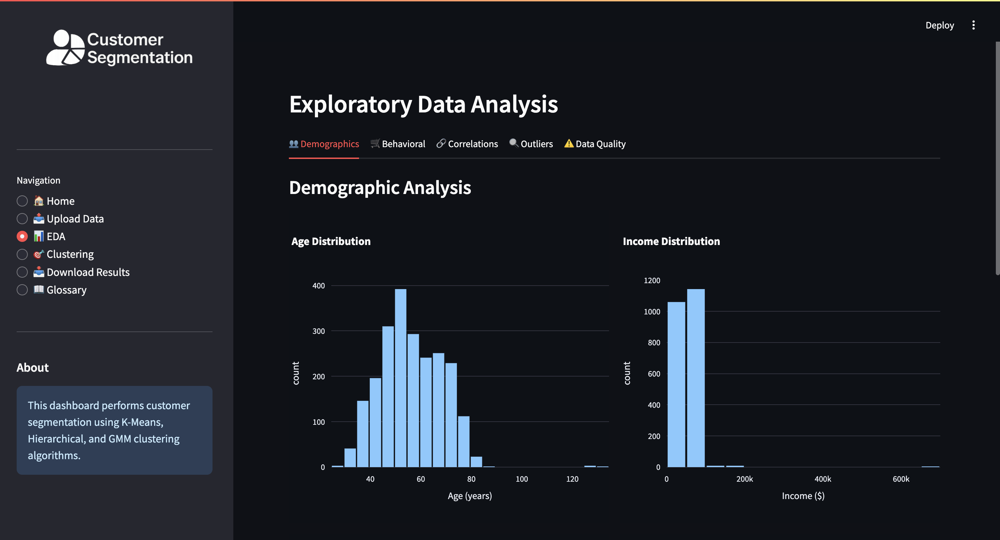
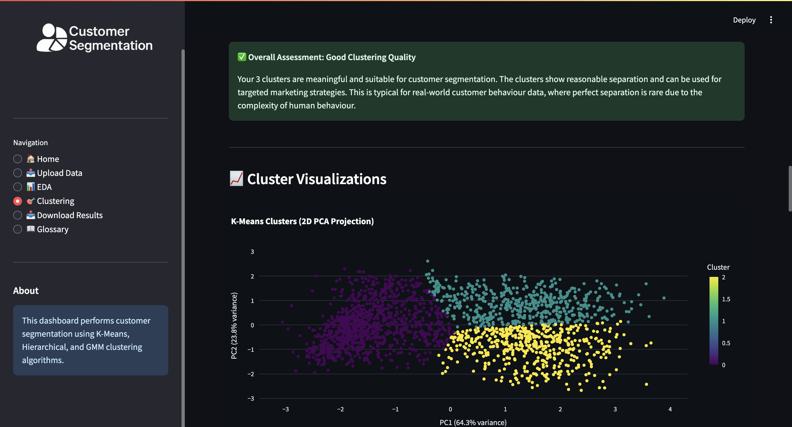
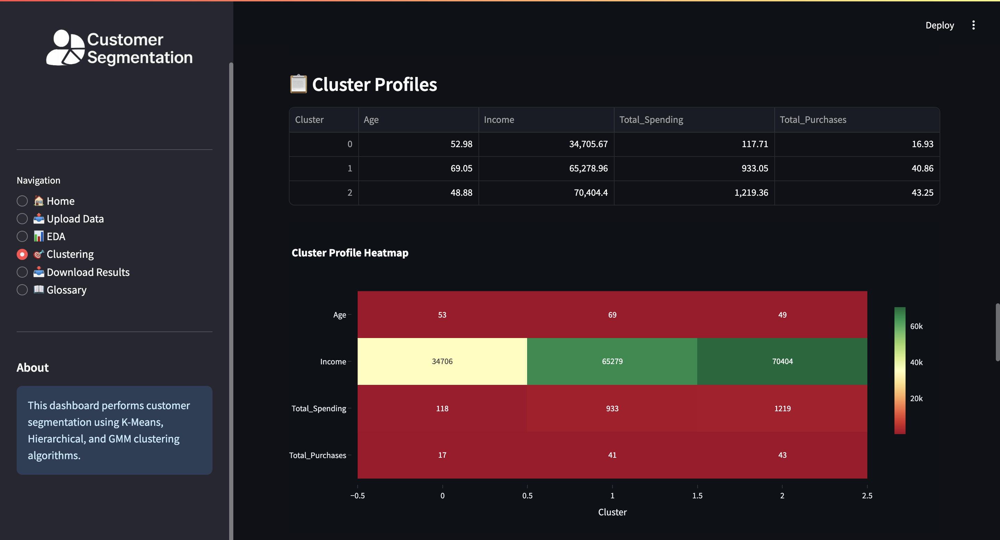
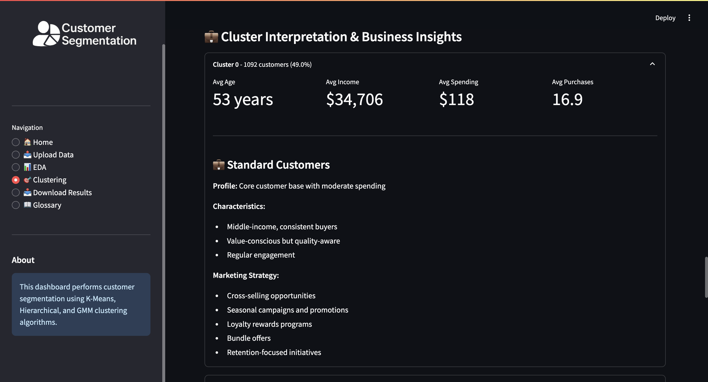

# 📊 Customer Segmentation Dashboard

A comprehensive machine learning dashboard for customer segmentation using K-Means, Hierarchical Clustering, and Gaussian Mixture Models. Built with Python and Streamlit.


## 🎯 Overview

This project provides an end-to-end solution for customer segmentation, enabling businesses to identify distinct customer groups for targeted marketing strategies. The dashboard offers interactive visualizations, multiple clustering algorithms, and comprehensive data quality checks.

### Key Features

- **📤 Data Upload & Validation** - Upload CSV files with built-in quality checks
- **📊 Exploratory Data Analysis** - Comprehensive demographic and behavioral analysis
- **🎯 Multiple Clustering Algorithms** - K-Means, Hierarchical (HAC), and Gaussian Mixture Models (GMM)
- **📈 Interactive Visualizations** - PCA projections, heatmaps, and distribution plots
- **💼 Business Insights** - Automated cluster interpretation and marketing recommendations
- **📥 Export Results** - Download segmented customer lists for marketing campaigns
- **🔍 Data Quality Checks** - Duplicate detection, outlier analysis, and missing value handling

## 🚀 Live Demo

**Version 1.0:** [Try it now](your-deployment-link-here) *(specialized for marketing data)*

**Version 2.0:** Coming soon - supports ANY customer dataset format! [Join the waitlist](#)

## 📋 Table of Contents

- [Installation](#installation)
- [Usage](#usage)
- [Data Requirements](#data-requirements)
- [Project Structure](#project-structure)
- [Clustering Algorithms](#clustering-algorithms)
- [Evaluation Metrics](#evaluation-metrics)
- [Screenshots](#screenshots)
- [Contributing](#contributing)
- [License](#license)
- [Contact](#contact)

## 🛠️ Installation

### Prerequisites

- Python 3.8 or higher
- pip package manager

### Setup

1. **Clone the repository**
```bash
git clone https://github.com/iamedobor/customer-segmentation.git
cd customer-segmentation
```

2. **Create a virtual environment** (recommended)
```bash
python -m venv venv

# On Windows
venv\Scripts\activate

# On macOS/Linux
source venv/bin/activate
```

3. **Install dependencies**
```bash
pip install -r requirements.txt
```

4. **Run the dashboard**
```bash
cd dashboard
streamlit run app.py
```

The dashboard will open in your browser at `http://localhost:8501`

## 💻 Usage

### Quick Start

1. **Upload Data**: Navigate to "Upload Data" and upload your customer CSV file
2. **Explore**: View comprehensive EDA including demographics, behavior, and data quality
3. **Cluster**: Select features, choose an algorithm, and run clustering
4. **Download**: Export segmented customer lists for marketing campaigns

### Sample Dataset

Don't have data? Download our sample dataset directly from the dashboard homepage or from `data/customer_segmentation.csv`

### Running the Jupyter Notebook

For a detailed walkthrough of the analysis:
```bash
jupyter notebook notebooks/customer_segmentation_analysis.ipynb
```

## 📊 Data Requirements

### Version 1.0 (Current)

This version is optimized for marketing and e-commerce datasets with the following structure:

**Required Columns:**
- `Year_Birth` or `Age` - Customer age
- `Income` - Annual income
- `Mnt*` columns - Spending by category (MntWines, MntMeatProducts, etc.)
- `Num*Purchase` columns - Purchase counts by channel
- `Recency` - Days since last purchase
- `NumWebVisitsMonth` - Website engagement

**Sample Data Structure:**
```
ID, Year_Birth, Education, Marital_Status, Income, Kidhome, Teenhome,
Dt_Customer, Recency, MntWines, MntFruits, MntMeatProducts, MntFishProducts,
MntSweetProducts, MntGoldProds, NumDealsPurchases, NumWebPurchases,
NumCatalogPurchases, NumStorePurchases, NumWebVisitsMonth
```

### Version 2.0 (Coming Soon)

Will support ANY customer dataset format with dynamic column mapping!

## 📁 Project Structure
```
customer-segmentation/
│
├── data/
│   └── customer_segmentation.csv      # Sample dataset
│
├── notebooks/
│   └── customer_segmentation_analysis.ipynb  # Complete analysis notebook
│
├── dashboard/
│   ├── app.py                         # Main Streamlit dashboard
│   ├── utils.py                       # Helper functions
│   └── logo.png
│
├── images/
│   ├── elbow_method.png              # Generated visualizations
│   ├── silhouette_analysis.png
│   └── ...
│
├── screenshots/
│   ├── home.png                       # Dashboard home screenshot
│   ├── eda_demographics.png           # EDA demographics screenshot
│   ├── clustering_results.png         # Clustering results screenshot
│   ├── cluster_profiles.png           # Cluster profiles screenshot
│   └── cluster_business_insight.png   # Business insights screenshot
│
├── src/
│   └── __init__.py                    # Makes src a Python package
│
├── results/
│   ├── clustered_customers_all_models.csv
│   ├── cluster_profiles_*.csv
│   ├── model_metrics.json
│   └── ...              
│
├── __init__.py                        # Makes root a Python package
├── requirements.txt                   # Python dependencies
├── README.md                          # This file
├── CONTRIBUTING.md                    # Contribution guidelines
├── LICENSE                            # MIT License
└── .gitignore                        # Git ignore rules
```

## 🤖 Clustering Algorithms

### 1. K-Means Clustering
- **Type:** Partition-based
- **Best for:** Large datasets with spherical clusters
- **Speed:** Fast
- **Use case:** Quick segmentation with clear separation

### 2. Hierarchical Clustering (HAC)
- **Type:** Tree-based (dendrogram)
- **Best for:** Understanding cluster hierarchy
- **Speed:** Moderate
- **Use case:** When relationships between segments matter

### 3. Gaussian Mixture Model (GMM)
- **Type:** Probabilistic
- **Best for:** Overlapping clusters, continuous data
- **Speed:** Moderate
- **Use case:** Soft cluster assignments, flexible shapes

## 📏 Evaluation Metrics

### Silhouette Score
- **Range:** -1 to 1 (higher is better)
- **Interpretation:** Measures cluster cohesion and separation
- **Good score:** > 0.5

### Davies-Bouldin Index
- **Range:** 0 to ∞ (lower is better)
- **Interpretation:** Ratio of within-cluster to between-cluster distances
- **Good score:** < 1.0

### Calinski-Harabasz Score
- **Range:** 0 to ∞ (higher is better)
- **Interpretation:** Variance ratio criterion
- **Good score:** > 500

## 📸 Screenshots

### Dashboard Home


### EDA - Demographics


### Clustering Results


### Cluster Profiles


### Cluster Profiles


## 🎓 Example Customer Segments

The dashboard typically identifies three distinct customer segments:

### 1. 🌟 Premium Customers (10-25%)
- **Profile:** High income, high spending, minimal children
- **Behavior:** Decisive buyers, frequent purchases, low browsing
- **Strategy:** VIP programs, premium products, exclusive offers

### 2. 💼 Standard Customers (30-40%)
- **Profile:** Middle income, moderate spending
- **Behavior:** Consistent purchasers, balanced engagement
- **Strategy:** Cross-selling, seasonal campaigns, loyalty rewards

### 3. 🛒 Budget Shoppers (40-50%)
- **Profile:** Lower income, budget-conscious, families
- **Behavior:** High browsing, low conversion, price-sensitive
- **Strategy:** Discount programs, family bundles, clearance alerts

## 🔧 Configuration

### Customizing the Dashboard

Edit `dashboard/app.py` to customize:
- Color schemes
- Default parameters
- Feature selections
- Algorithm options

### Adding Custom Algorithms

Add new clustering algorithms in the "Algorithm Selection" section of `app.py`:
```python
elif algorithm == "Your Algorithm":
    model = YourClusteringModel(parameters)
    labels = model.fit_predict(df_scaled)
```

## 🤝 Contributing

Contributions are welcome! Please feel free to submit a Pull Request.

1. Fork the repository
2. Create your feature branch (`git checkout -b feature/AmazingFeature`)
3. Commit your changes (`git commit -m 'Add some AmazingFeature'`)
4. Push to the branch (`git push origin feature/AmazingFeature`)
5. Open a Pull Request

## 📝 License

This project is licensed under the MIT License - see the [LICENSE](LICENSE) file for details.

## 👨‍💻 Author

**Osasere Edobor**

- Portfolio: [https://portfolio.edoborosasere.com/](https://portfolio.edoborosasere.com/)
- LinkedIn: [Your LinkedIn](https://linkedin.com/in/osasere-edobor)
- Email: projects@edoborosasere.com

## 🙏 Acknowledgments

- Dataset source: [Vishakh Patel](https://www.kaggle.com/datasets/vishakhdapat/customer-segmentation-clustering)
- Built with [Streamlit](https://streamlit.io/)
- Clustering algorithms from [scikit-learn](https://scikit-learn.org/)

## 🚀 Roadmap

### Version 2.0 (Coming Soon)
- [ ] Dynamic column mapping for any CSV format
- [ ] CRM integration (Salesforce, HubSpot, Mailchimp)
- [ ] REST API for programmatic access
- [ ] Project save/load functionality
- [ ] Additional clustering algorithms (DBSCAN, HDBSCAN)
- [ ] Team collaboration features
- [ ] Custom branding options

### Future Enhancements
- [ ] Real-time clustering updates
- [ ] A/B testing framework
- [ ] Predictive customer lifetime value
- [ ] Churn prediction integration
- [ ] Multi-language support

## ⭐ Star History

If you find this project useful, please consider giving it a star!

[](https://star-history.com/#iamedobor/Data-Science-Projects&Date)


---

**Made with ❤️ by [Osasere Edobor](https://portfolio.edoborosasere.com/)**