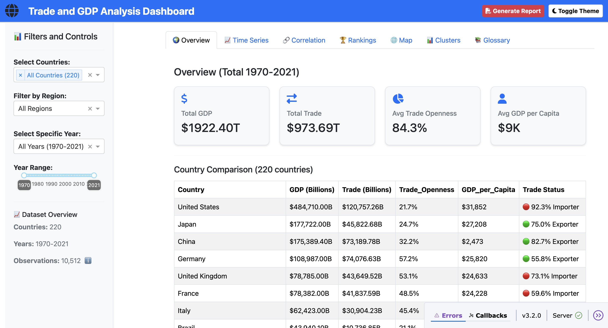
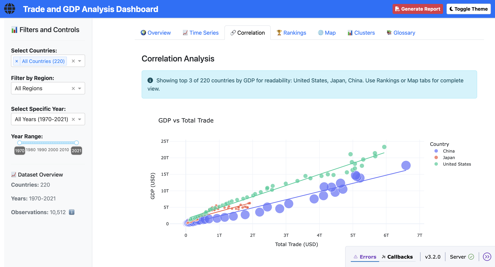
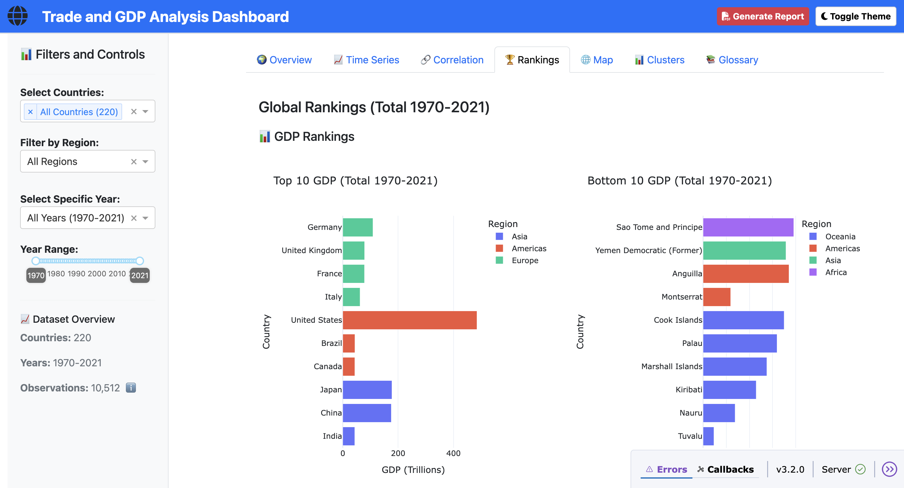
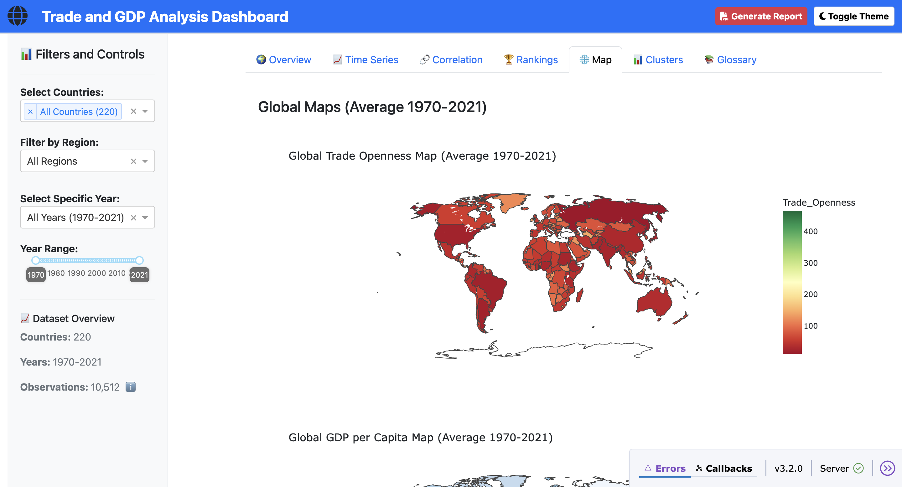
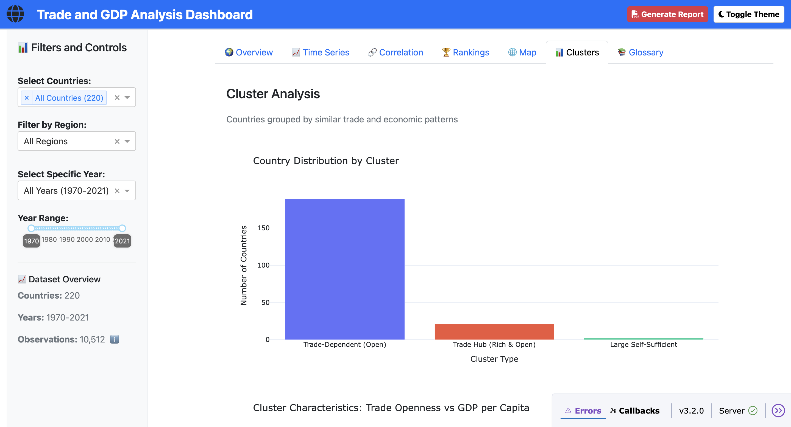

# 🌍 Trade and GDP Analysis Dashboard

<div align="center">

**An Interactive Data Analytics Platform Exploring the Relationship Between International Trade and Economic Growth**

[](https://www.python.org/)
[](https://dash.plotly.com/)
[](LICENSE)
[]()

[Live Demo](#) • [Features](#features) • [Installation](#installation) • [Analysis](#key-findings)

</div>

---

## 📋 Table of Contents

- [Overview](#-overview)
- [Research Question](#-research-question)
- [Live Demo](#-live-demo)
- [Features](#-features)
- [Key Findings](#-key-findings)
- [Installation](#-installation)
- [Project Structure](#-project-structure)
- [Data Source](#-data-source)
- [Technologies Used](#-technologies-used)
- [Deployment](#-deployment)
- [Contributing](#-contributing)
- [License](#-license)
- [Author](#-author)

---

## 🎯 Overview

This project provides a comprehensive analysis of **how international trade impacts economic growth** across 220 countries spanning 52 years (1970-2021). The analysis combines rigorous statistical methods with an interactive visualization dashboard to make complex economic relationships accessible and actionable.

**What Makes This Project Unique:**
- 📊 **Comprehensive Analysis**: 10,512 observations with 15 engineered features
- 🔬 **Advanced Statistics**: Panel regression, Granger causality, clustering analysis
- 🎨 **Interactive Dashboard**: Built with Plotly Dash for dynamic exploration
- 📈 **Actionable Insights**: Clear evidence-based conclusions for policy and business
- 🌐 **Production-Ready**: Deployed on Render with optimized performance

---

## ❓ Research Question

> **"To what extent does international trade (imports and exports) correlate with the economic growth (GDP) of nations?"**

### Answer Summary:
**Extremely strong correlation (r = 0.90, p < 0.001)** with robust causal evidence. A 1% increase in trade leads to a **0.65% increase in GDP** after controlling for country and time effects. Net exporters are **236% wealthier per capita** than net importers.

[**Read Full Analysis →**](#-key-findings)

---

## 🌐 Live Demo

### 🚀 **[View Live Dashboard](https://trade-gdp-dashboard.onrender.com)** 
*Update this link after deploying to Render*

### 📸 Dashboard Preview

<div align="center">

| Global Overview | Time Series Analysis |
|:---:|:---:|
|  |  |

| Correlation Explorer | Global Rankings |
|:---:|:---:|
|  |  |

| Interactive World Map | Cluster Analysis |
|:---:|:---:|
|  |  |

</div>

---

## ✨ Features

### 📊 Interactive Dashboard
- **🌍 Global Overview**: Real-time aggregate metrics with country comparisons
- **📈 Time Series Visualization**: Track 52 years of economic trends (1970-2021)
- **🔗 Correlation Explorer**: Interactive scatter plots with regression trendlines
- **🏆 Global Rankings**: Top 10 and Bottom 10 performers across key metrics
- **🗺️ Choropleth Maps**: Geographic visualization of trade openness and GDP per capita
- **📊 Cluster Analysis**: Discover 3 distinct country archetypes by trade patterns
- **🌓 Theme Toggle**: Seamless light/dark mode switching
- **📚 Built-in Glossary**: In-dashboard definitions of economic terms
- **🎯 Dynamic Filtering**: Country, region, and year-based data exploration

### 🔬 Advanced Analytics (Notebook)
- **Data Cleaning**: Handling 220 countries, 52 years, missing values, outliers
- **Feature Engineering**: 15 derived metrics (Trade Openness, GDP per Capita, Growth Rates)
- **Statistical Tests**: Pearson/Spearman correlation with p-values < 0.001
- **Regression Models**: Linear, Multiple, Panel Data (R² = 0.63-0.99)
- **Granger Causality**: Testing predictive relationships between trade and GDP
- **K-Means Clustering**: Optimal cluster identification with silhouette score analysis
- **Regional Analysis**: Continental patterns in trade and economic development

---

## 🔑 Key Findings

### 1. **Strong Statistical Correlation**
The relationship between trade and GDP is exceptionally robust:

| Relationship | Pearson r | P-value | Variance Explained |
|--------------|-----------|---------|-------------------|
| **GDP ↔ Total Trade** | **0.90** | < 0.001 | 81% |
| **GDP ↔ Exports** | 0.87 | < 0.001 | 75% |
| **GDP ↔ Imports** | **0.92** | < 0.001 | 85% |

**Key Insight**: Imports show slightly stronger correlation than exports (0.92 vs 0.87), challenging traditional mercantilist assumptions.

---

### 2. **Robust Causal Estimate**
Using **two-way fixed effects panel regression** (controlling for country characteristics and time shocks):
```
🎯 A 1% increase in trade → 0.65% increase in GDP
```

**When separating trade components:**
- Exports: +0.28% impact on GDP
- Imports: +0.37% impact on GDP (32% stronger effect)

Both are highly significant (p < 0.001) after controlling for confounding factors.

---

### 3. **Trade Grows Faster Than GDP**
Global economic integration accelerated dramatically:

| Metric | 1970 | 2021 | Growth Multiplier |
|--------|------|------|-------------------|
| **GDP** | $3.4T | $95.9T | **28x** |
| **Trade** | $0.9T | $54.2T | **60x** |

**Trade grew 2.1x faster than GDP**, demonstrating deepening global interconnection.

---

### 4. **Net Exporters Are Significantly Wealthier**

| Metric | Net Exporters | Net Importers | Difference |
|--------|---------------|---------------|------------|
| **GDP per Capita** | $17,566 | $5,234 | **+236%** 🔥 |
| **Mean GDP** | $260.17B | $145.11B | +79% |
| **Trade Openness** | 97.8% | 77.7% | +20.1pp |

Despite being only 33% of observations, net exporters account for **47% of cumulative GDP**.

---

### 5. **Regional Patterns: Trade + Export Strength = Wealth**

Wealth requires **BOTH** high trade openness AND export competitiveness:

| Region | Trade Openness | Net Exporter Rate | GDP per Capita | Rank |
|--------|----------------|-------------------|----------------|------|
| **Europe** | 99.8% | **44.4%** ✓ | $22,180 | 1st 🥇 |
| **Americas** | 85.2% | 33.5% | $9,715 | 2nd 🥈 |
| **Asia** | 85.8% | **40.9%** | $7,297 | 3rd 🥉 |
| **Oceania** | 92.6% | **17.3%** ✗ | $7,020 | 4th |
| **Africa** | 67.8% | 21.4% | $1,466 | 5th |

**Why Oceania ranks lower despite high openness?** Lowest net exporter rate (17.3%) reveals that trade quality matters as much as trade volume.

---

### 6. **Small Countries Trade More Intensively**

| Population | Trade Openness | Trade per Capita | Net Exporter % |
|------------|----------------|------------------|----------------|
| **Small (<10M)** | 100.2% | $13,410 | 31.7% |
| **Very Large (>100M)** | 32.6% | $2,441 | 47.4% |

Small economies trade **5.5x more per person** than large economies, demonstrating greater reliance on international markets.

---

### 7. **Directionality: GDP Drives Trade**
Granger causality testing reveals asymmetric predictive relationships:

| Direction | Result | Interpretation |
|-----------|--------|----------------|
| **Trade → GDP** | ❌ Not significant | Past trade doesn't predict future GDP |
| **GDP → Trade** | ✅ Significant (lags 2-4) | Past GDP predicts future trade |

**Conclusion**: Economic growth enables trade expansion more than trade directly causes growth. Trade is a **channel** for prosperity, not the sole driver.

---

### 8. **Three Distinct Country Archetypes** (2015-2021 Analysis)

| Cluster | Countries | Trade Openness | GDP per Capita | Examples |
|---------|-----------|----------------|----------------|----------|
| **🟢 Trade Hubs** | 21 | 179.2% | **$74,192** | Singapore, Hong Kong, Netherlands |
| **🔵 Trade-Dependent** | 189 | 82.1% | $10,484 | Germany, Japan, India, Brazil |
| **🔴 Large Self-Sufficient** | 2 | 31.7% | $35,521 | **USA, China** |

Trade hubs achieve extraordinary wealth through extreme trade integration (179% openness = trade nearly 2x their GDP).

---

### 🎯 Policy Implications

1. **Trade Integration Matters**: Countries with >100% trade openness show significantly higher wealth
2. **Export Competitiveness Pays Off**: Net exporters are 236% wealthier per capita
3. **Size Determines Strategy**: Small countries must leverage trade; large countries can be self-sufficient
4. **Imports Drive Growth Too**: Imports show 32% stronger GDP effect than exports, suggesting they provide:
   - Access to cheaper inputs and capital goods
   - Technology transfer and knowledge spillovers
   - Consumer welfare improvements

---

## 🚀 Installation

### Prerequisites
- **Python 3.11+** 
- pip (Python package manager)
- Git

### Quick Start
```bash
# 1. Clone repository
git clone https://github.com/iamedobor/Data-Science.git
cd Data-Science/trade-gdp-analysis

# 2. Create virtual environment (recommended)
python -m venv venv

# Activate virtual environment
# Windows:
venv\Scripts\activate
# macOS/Linux:
source venv/bin/activate

# 3. Install dependencies
pip install -r requirements.txt

# 4. Run dashboard
python dashboard.py
```

The dashboard will open at **`http://127.0.0.1:8050/`**

---

## 📂 Project Structure
```
Data-Science/
│
└── trade-gdp-analysis/
    ├── analysis.ipynb              # Complete Jupyter notebook with full analysis
    ├── dashboard.py                # Interactive Dash application
    ├── requirements.txt            # Python dependencies
    ├── runtime.txt                 # Python version for deployment
    ├── render.yaml                 # Render deployment configuration
    ├── README.md                   # Project documentation
    ├── .gitignore                  # Git ignore rules
    │
    ├── data/                       # Processed datasets
    │   ├── featured_data.csv       # Cleaned data with 15 engineered features
    │   ├── cluster_data.csv        # Country cluster assignments (K-means)
    │   └── summary_stats.json      # Dataset metadata and aggregate statistics
    │
    └── screenshots/                # Dashboard screenshots
        ├── overview.png
        ├── timeseries.png
        ├── correlation.png
        ├── rankings.png
        ├── map.png
        └── clusters.png
```

---

## 📊 Data Source

**Dataset**: [Global Economy Indicators](https://www.kaggle.com/datasets/willianoliveiragibin/global-economy-indicators) (Kaggle)

### Dataset Details

- **Countries**: 220
- **Time Period**: 1970 - 2021 (52 years)
- **Observations**: 10,512 country-year combinations
- **Original Variables**: 26 economic indicators
- **Engineered Features**: 15 additional metrics

### Key Variables

| Variable | Description | Type |
|----------|-------------|------|
| `GDP` | Gross Domestic Product (USD) | Numeric |
| `Exports` | Exports of goods and services (USD) | Numeric |
| `Imports` | Imports of goods and services (USD) | Numeric |
| `Population` | Total population | Numeric |
| `Trade_Openness` | (Exports + Imports) / GDP × 100 | Engineered |
| `GDP_per_Capita` | GDP / Population | Engineered |
| `Trade_Balance` | Exports - Imports | Engineered |
| `Net_Exporter` | Boolean: Exports > Imports | Engineered |

---

## 🛠️ Technologies Used

### Data Analysis & Statistics
- **Python 3.11** - Core programming language
- **Pandas** - Data manipulation and analysis
- **NumPy** - Numerical computations
- **Scikit-learn** - Machine learning (K-Means clustering, StandardScaler)
- **SciPy** - Statistical hypothesis testing
- **Statsmodels** - Time series analysis and regression
- **Linearmodels** - Panel data econometrics (Fixed Effects, Two-way FE)

### Visualization & Dashboard
- **Plotly** - Interactive charts and graphs
- **Dash** - Web application framework
- **Dash Bootstrap Components** - UI components and styling
- **Matplotlib** - Static visualizations (in notebook)

### Deployment & DevOps
- **Gunicorn** - Production WSGI server
- **Render** - Cloud hosting platform
- **Git & GitHub** - Version control

---

## 🚀 Deployment

This project is configured for **Render** deployment (free tier).

### Deploy to Render

1. **Fork/Clone this repository**
2. **Create a Render account** at [render.com](https://render.com)
3. **Create New Web Service**:
   - Connect your GitHub repository
   - Select `trade-gdp-analysis` directory
   - Render will automatically detect `render.yaml`
4. **Deploy!** 
   - First deployment takes ~5 minutes
   - Your app will be live at `https://your-app.onrender.com`

### Manual Deployment (Alternative)

If `render.yaml` doesn't auto-detect:
```yaml
# In Render dashboard, configure:
Build Command: pip install -r requirements.txt
Start Command: gunicorn dashboard:server
```

### Local Development
```bash
# Run in development mode
python dashboard.py

# Run with Gunicorn (production mode)
gunicorn dashboard:server --bind 0.0.0.0:8050
```

---

## 🤝 Contributing

Contributions are welcome! Here's how:

1. **Fork the repository**
2. **Create a feature branch**
```bash
   git checkout -b feature/AmazingFeature
```
3. **Commit your changes**
```bash
   git commit -m 'Add some AmazingFeature'
```
4. **Push to branch**
```bash
   git push origin feature/AmazingFeature
```
5. **Open a Pull Request**

### Ideas for Contributions:
- [ ] Add ARIMA/LSTM forecasting models
- [ ] Implement sector-level trade analysis
- [ ] Add real-time data via API integration
- [ ] Improve mobile responsiveness
- [ ] Add more clustering algorithms (DBSCAN, Hierarchical)

---

## 📄 License

This project is licensed under the **MIT License** - see the [LICENSE](LICENSE) file for details.

---

## 👤 Author

**Osasere Edobor**

- 🌐 Portfolio: [portfolio.edoborosasere.com](https://portfolio.edoborosasere.com/)
- 💼 LinkedIn: [linkedin.com/in/osasere-edobor](https://www.linkedin.com/in/osasere-edobor/)
- 🐙 GitHub: [@iamedobor](https://github.com/iamedobor)
- 📧 Email: projects@edoborosasere.com

---

## 🙏 Acknowledgments

- **Dataset**: [Heidar Mirhaji Sadati](https://www.kaggle.com/heidarmirhajisadati) on Kaggle
- **Inspiration**: Global economic research and evidence-based policy making
- **Tools**: Plotly Dash community, Render platform

---

## 📈 Future Enhancements

- [ ] **Time Series Forecasting**: ARIMA/LSTM to predict future GDP and trade
- [ ] **Causality Network Graph**: Visualize trade dependencies between nations
- [ ] **Sector Analysis**: Break down trade by industry (manufacturing, services, agriculture)
- [ ] **Real-time Data Integration**: Connect to World Bank or IMF APIs
- [ ] **Advanced Clustering**: Try DBSCAN, hierarchical methods
- [ ] **Mobile App**: React Native version for iOS/Android

---

<div align="center">

**⭐ Star this repo if you found it helpful!**

Made with ❤️ and 📊 by [Osasere Edobor](https://portfolio.edoborosasere.com/)

</div>